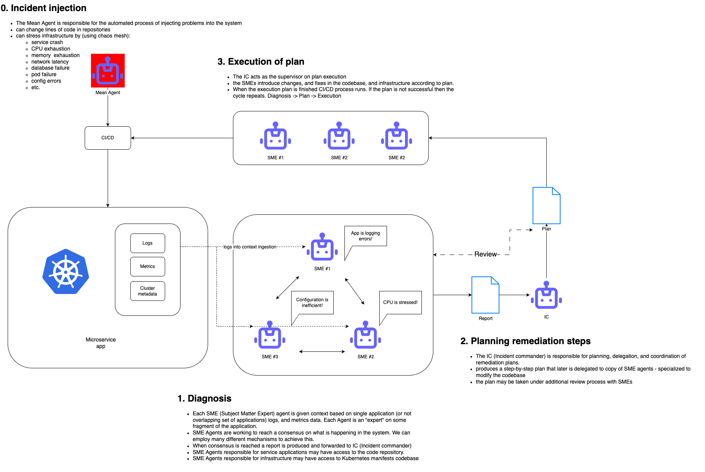

# Temat pracy magisterskiej

## Autoremediacja aplikacji mikroserwisowej z wykorzystaniem systemu wieloagentowego

Celem pracy jest stworzenie systemu wieloagentowego, który będzie monitorował aplikację mikroserwisową uruchomioną na klastrze Kubernetes.

Aplikacja wdrożona na klastrze będzie jedną z aplikacji przedstawionych w niniejszej publikacji:

* [An Overview of Microservice-Based Systems Used for Evaluation
in Testing and Monitoring: A Systematic Mapping Study](https://elib.dlr.de/211381/1/2024_AST_MicroService_BMK.pdf)

System wieloagentowy będzie miał dostęp do logów, metryk poszczególnych serwisów, a także do kodu źródłowego aplikacji.

Aplikacja mikroserwisowa będzie poddawana drobnym modyfikacjom lub jej infrastruktura będzie sztucznie obciążana.

Zadaniem systemu wieloagentowego będzie poprawne zdiagnozowanie przyczyny awarii na podstawie dostępnych informacji (logi, metryki, kod źródłowy), opracowanie planu remediacji oraz egzekucja tego planu w celu przywrócenia prawidłowego działania aplikacji.

---

[link do diagramu](/imgs/diagram-2.drawio.png)

---

### Sposób generowania awarii

W tym celu zostanie stworzona osobna aplikacja agentowa, której zadaniem będzie wprowadzanie niewielkich, losowych zmian w wybranych miejscach aplikacji, mających na celu zakłócenie pracy serwisów. Dodatkowo będzie ona mogła indukować stres infrastrukturalny — lub wykonywać obie te czynności w różnych kombinacjach.

---

### Potencjalne kierunki badawcze:

- Jak różne modele diagnozy radzą sobie z wykrywaniem problemów, planowaniem i realizacją remediacji?
- W jaki sposób różne mechanizmy podejmowania decyzji wpływają na skuteczność diagnozy?
- Jaki jest optymalny zakres odpowiedzialności agenta typu SME (Subject Matter Expert)? Ile agentów potrzeba do skutecznej diagnozy systemu?
- Jak system poradzi sobie z nietrywialnymi awariami, np. wieloma błędami jednocześnie lub dodatkowym stresem infrastruktury?

---

### Bibliografia:
*  [Leveraging Large Language Models for the Auto-remediation of Microservice Applications: An Experimental Study](https://dl.acm.org/doi/pdf/10.1145/3663529.3663855) - publikacja która mnie zainspirowała do tematu pracy magisterskiej, 
w badaniu realizują podobną z tą różnicą, że nie wykorzystują wielu agentów, skupiają się głównie na infrastrukturze

*  [Reliable Decision-Making for Multi-Agent LLM System](https://multiagents.org/2025_artifacts/reliable_decision_making_for_multi_agent_llm_systems.pdf) - przydatna publikacja w kontekscie modelu podejmowania decyzji podczas diagnozy

*  [LLM Multi-Agent Systems: Challenges and Open Problems](https://arxiv.org/pdf/2402.03578)
